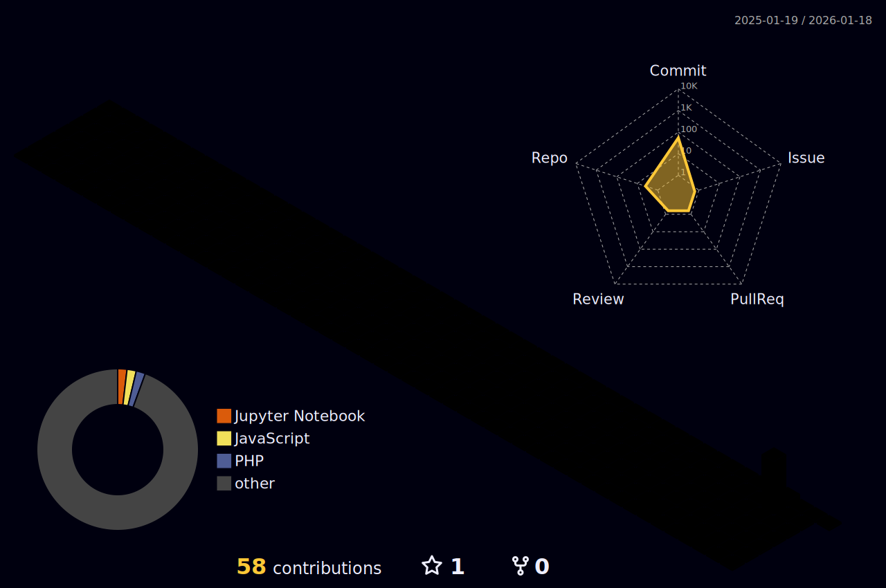

# 👋 Hi, there I'm Rao Mitesh

<div align="center" style="top:5px;">

</div>

<div align="center">
  
[](https://git.io/typing-svg)

[](https://raomitesh.me)
[](https://linkedin.com/in/rao-mitesh-a87876280)
[](https://github.com/RaoMitesh21)
[](mailto:raomitesh12@gmail.com)


</div>

---

## 🚀 About Me

```python
class RaoMitesh:
    def __init__(self):
        self.username = "RaoMitesh21"
        self.role = "Data Science Student"
        self.university = "JG University"
        self.cgpa = 8.75/10
        self.rank = "🏆 #Top Performer in Data Science Stream"
        self.location = "Ahmedabad, Gujarat, India"
        
    def current_focus(self):
        return [
            "Building AI-powered applications",
            "Real-time communication systems",
            "Full-stack web development",
            "Machine Learning model deployment"
        ]
    
    def achievements(self):
        return {
            "academic": "Rank 1 (Sem 1 & 2) with 8.75 CGPA",
            "projects": ["Talksy Chat App", "ThunderCast AI", "Profit Paradox ML"],
            "certifications": "freeCodeCamp Responsive Web Design",
            "hackathons": "LJ University AI Hackathon Participant"
        }
```


### 💡 What I'm Up To

- 🔭 **Currently Working On:** Building AI-powered applications and real-time systems using React, Python, and ML
- 👯 **Looking to Collaborate On:** Open-source AI/ML projects, data science applications, and full-stack web development
- 🤝 **Seeking Help With:** Advanced ML techniques, Deep Learning frameworks (TensorFlow, PyTorch), Cloud deployment (AWS, Azure)
- 🌱 **Currently Learning:** Advanced ML algorithms, React patterns, Data Engineering, MLOps, and Cloud computing
- 💬 **Ask Me About:** Python, React.js, Machine Learning (XGBoost, Random Forest), WebSocket, Data Science, SQL, PHP
- ⚡ **Fun Fact:** Achieved Rank 1 in Data Science with 8.75 CGPA! Built a real-time chat app with WebSockets in semester 3 and developed an AI weather prediction model at a hackathon 🚀

---

## 💼 Experience

### 🔬 Machine Learning Intern | CS Vision *(Virtual)*
**Aug 2025 - Sept 2025**

- Built Profit Paradox ML system achieving 85%+ R² score using XGBoost and Random Forest
- Engineered customer segmentation pipeline delivering actionable insights for discount optimization
- Developed interactive Streamlit dashboard for real-time predictions and data visualizations
- Conducted comprehensive EDA and preprocessed 10K+ records, outperforming baseline by 40%

---

## 🛠️ Tech Stack

### 💻 Languages


### 🎨 Frontend Development


### ⚙️ Backend & Database


### 🤖 Data Science & ML


### 🛠️ Tools & Technologies


---

## 🏆 Featured Projects

<div align="center">

### 🌐 [Personal Portfolio Website](https://raomitesh.me)
**React • HTML5 • CSS3 • JavaScript • Responsive Design**

Modern, interactive portfolio showcasing projects, skills, and achievements. Features responsive design, smooth animations, and optimized performance. Custom domain with SSL certificate and GitHub Pages deployment.

[](https://raomitesh.me)

---

### 💬 [Talksy - Real-Time Chat Application](https://github.com/RaoMitesh21/Talksy)
**React • PHP • WebSocket (Ratchet) • MySQL**

Built a full-stack real-time messaging platform enabling instant bidirectional communication for 100+ concurrent users with sub-100ms latency. Engineered responsive React.js interface and secure PHP-MySQL backend.

---

### 🌩️ [ThunderCast - Weather Prediction AI](https://github.com/RaoMitesh21/ThunderCast)
**Python • Machine Learning • Data Analysis**

Developed AI-powered prediction model for thunderstorms and gale force wind speeds at LJ University AI Hackathon. Implemented ML algorithms achieving accurate predictions for early warning systems.

---

### 📊 [Profit Paradox - Sales Prediction ML System](https://github.com/RaoMitesh21/Profit-Paradox)
**Python • XGBoost • Random Forest • Streamlit**

Built ML system achieving 85%+ R² score predicting sales-profit patterns on 10K+ retail records. Developed interactive Streamlit dashboard for real-time predictions and business intelligence.

</div>

---
## 🏅 Achievements & Certifications

<div align="center">

| 🎓 Achievement | 📅 Year | 🏆 Details |
|---------------|---------|-----------|
| **Rank 1 - Data Science** | 2025 | JG University (Semester 1 & 2) - CGPA: 8.75 |
| **Responsive Web Design** | 2025 | freeCodeCamp Certification |
| **AI Hackathon Participant** | 2025 | LJ University - Weather Prediction Model |
| **ML Intern** | 2025 | CS Vision - Profit Paradox Project |

</div>

---


## 📊 GitHub Statistics
<div align="center">
<a href="https://github.com/RaoMitesh21">
  
  
</a>
</div>
<div align="center">
<a href="https://github.com/RaoMitesh21">
  
  
</a>
</div>
<div align="center">

</div>
---

### 🌍 World Rendering (3D Contribution View)
<div align="center">
  
</div>

---

## 🐍 Contribution Snake

<div align="center">


</div>

---

## 🎯 Current Goals for 2025

```javascript
const goals2026 = {
    learning: [
        "Master Deep Learning & Neural Networks",
        "Advanced React patterns & Next.js",
        "Cloud deployment (AWS/Azure)",
        "MLOps & Production ML pipelines"
    ],
    projects: [
        "Open-source AI/ML contributions",
        "Personal portfolio v2.0 with animations",
        "Advanced chat app with AI integration",
        "Contribute to 10+ open-source repos"
    ],
    career: [
        "Land Data Science internship at top tech company",
        "Build strong GitHub portfolio (50+ repos)",
        "Network with 100+ developers",
        "Speak at tech meetups/conferences"
    ]
};
```

---

## 📫 Let's Connect!

<div align="center">

I'm always excited to collaborate on innovative projects and connect with fellow developers!

[](https://raomitesh.me)
[](https://linkedin.com/in/rao-mitesh-a87876280)
[](mailto:raomitesh12@gmail.com)
[](https://github.com/RaoMitesh21)

**"Turning complex problems into elegant solutions, one line of code at a time."** 💻✨

</div>

---

<div align="center">

### 💭 Random Dev Quote


### 😂 Random Dev Meme

<div align="center">


</div>
---


**✨ Crafted with 💙 by Rao Mitesh**
</div>
